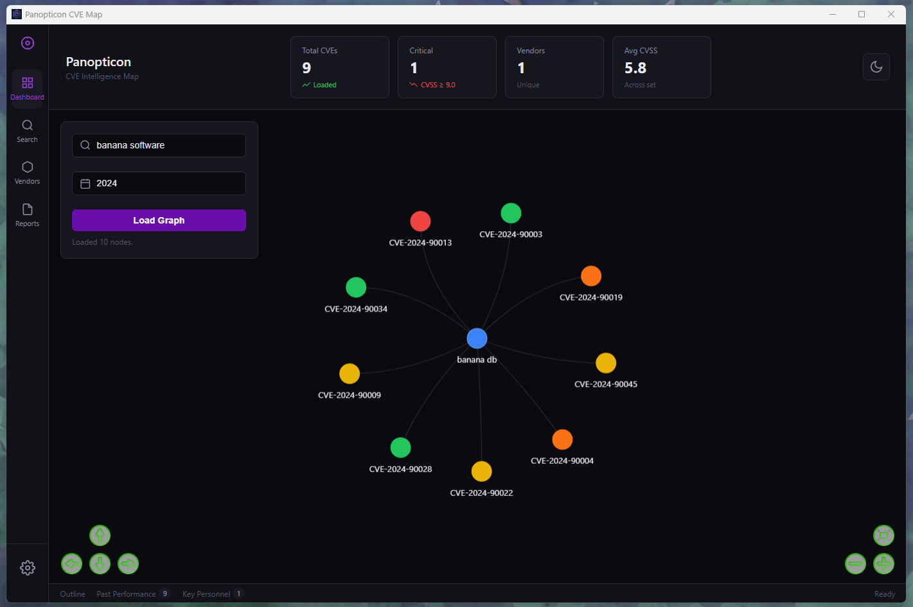
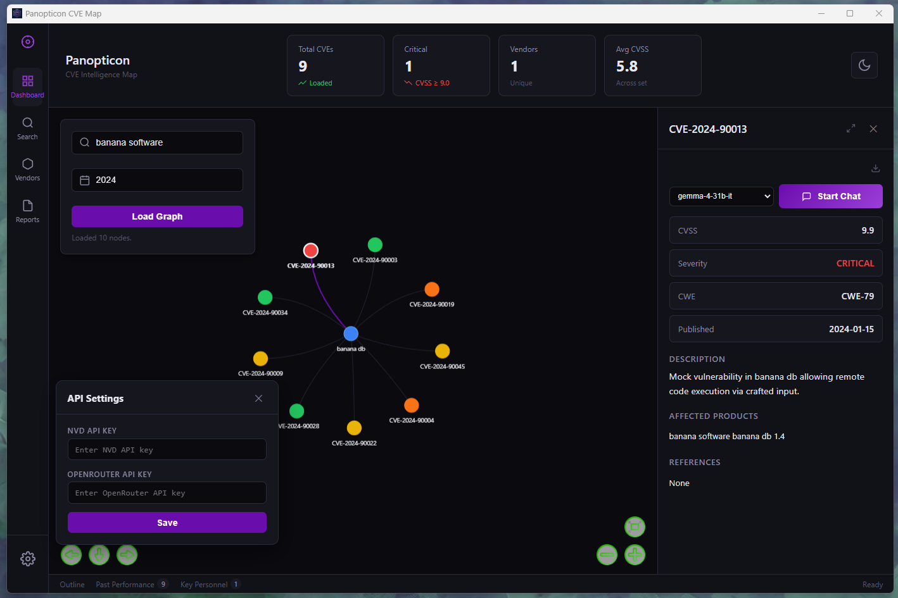
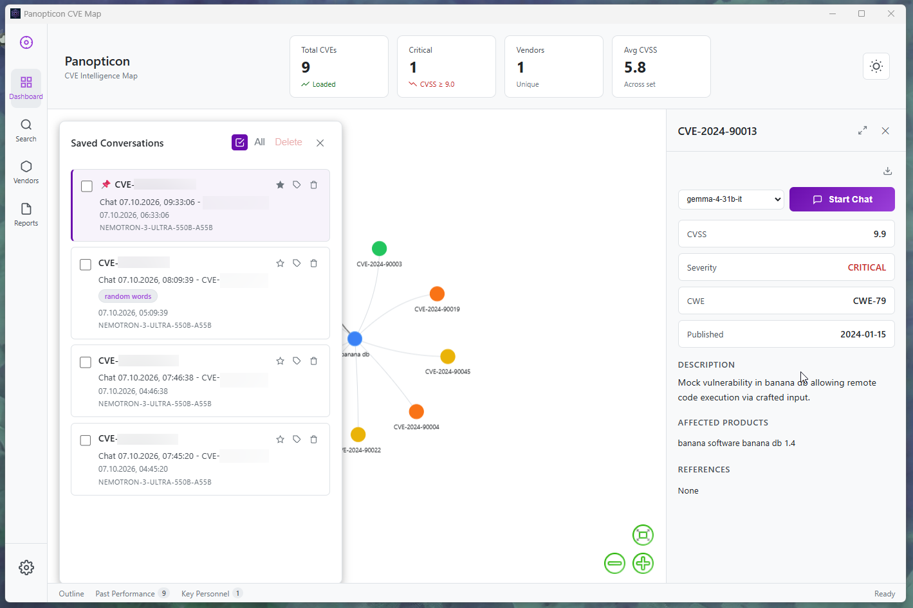
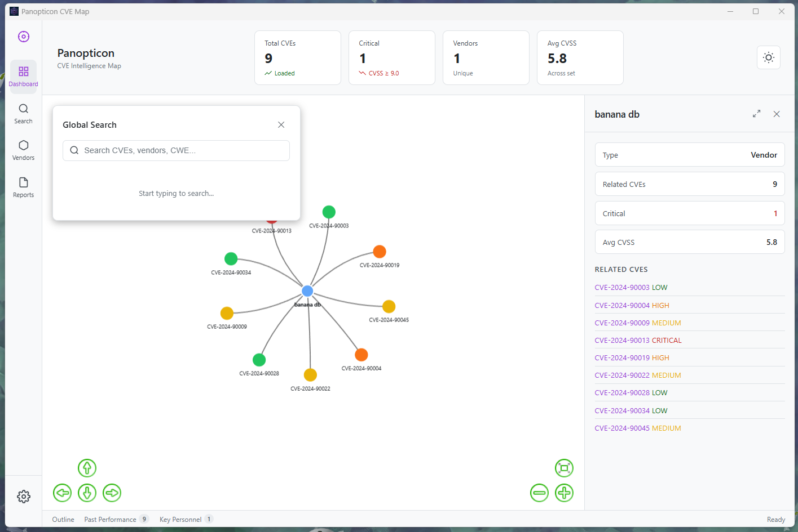

<div align="center">

<a href="https://github.com/sleepti3ht/Panopticon"></a>

# Panopticon

### CVE Intelligence Map · Threat graph + local AI mitigation agent

[](https://tauri.app)
[](https://www.rust-lang.org)
[](https://python.org)
[]()
[]()
[](LICENSE)

</div>

> 👁️ **A desktop-native CVE intelligence map** — interactive force-directed graph of vendor↔CVE relationships wired to a local AI agent that drafts mitigation plans, maintains a versioned chat history, and resumes conversations across sessions.

Built on **Tauri 2** (Rust shell), **Python** (async AI + MCP client), and **Vanilla JS** with `vis-network`. Local-first, no telemetry, no cloud lock-in.

## Screenshots

<p align="center">
  
  
  
  
</p>

---

## Get started

```bash
git clone https://github.com/sleepti3ht/Panopticon.git
cd Panopticon/panopticon-desktop

# Python backend
cd panopticon-python
python -m venv venv
venv\Scripts\activate        # Windows
source venv/bin/activate     # macOS / Linux
pip install -r requirements.txt
cp .env.example .env         # add your OPENROUTER_API_KEY

# Frontend + Tauri
cd ..
npm install
npm run tauri dev
```

> First launch will auto-create `panopticon.db` (SQLite) with the schema. Run `seed_mock.py` to populate sample vendors and CVEs without an NVD API key.

## 🔋 Batteries Included

**🕸 Force-directed threat graph**

- `vis-network` with `forceAtlas2Based` solver, auto-stabilization and CPU-off after 1500 iterations
- CVSS-based node coloring (critical → red, high → orange, low → green)
- Instant theme swap (light/dark) via `network.setOptions()` — no re-render
- Camera focus + selection animation on CVE jump

**🤖 Local AI mitigation agent**

- Model Context Protocol (MCP) client for live CVE context retrieval
- Pluggable OpenRouter free-tier models (`gemma-4-31b-it`, `llama-3.1-8b`, `qwen-3.8`)
- Strict 5-point mitigation prompts (risk, immediate actions, long-term, commands, refs)
- Automatic language detection — responds in the user's language

**💬 Versioned chat with memory**

- 10-message sliding window serialized through IPC
- Copy & Regenerate on every message, version indicator (`2/3`)
- Race-condition-safe UI (isProcessing guard + finally-unblock)
- XSS-safe markdown rendering (HTML-tag escaping before transform)

**📚 Reports — resumable conversations**

- Auto-save to SQLite after every assistant turn
- Click a report → rebuild graph around that CVE (default → vendor-scoped fallback)
- Camera focuses on the node, details panel opens, chat is restored and continuable
- `save_report.py purge` cleans legacy rows with invalid JSON payloads

**⚙️ Desktop shell**

- No startup flash (window hidden until first paint)
- External links open in system browser
- Debounced search (300ms), mutually exclusive side panels
- Settings popover with `localStorage` for API keys

## 📸 Preview

<p align="center">
  
  <em>Vendor↔CVE graph · dark theme · purple severity accents</em>
</p>

## Why Panopticon

Vulnerability triage today is a browser tab soup: NVD, vendor advisories, CISA KEV, ChatGPT, internal runbooks — all in separate windows. The analyst context-switches constantly and the mental model of "this CVE, this vendor, these affected products, these mitigations" never lives in one place.

Panopticon collapses that into a single native surface:

- **Spatial memory** — the graph is the mental map; clicking a CVE recenters the world around it.
- **Stateful analysis** — the AI remembers the conversation and the CVE context simultaneously.
- **Resumable work** — close the app, open it tomorrow, pick up exactly where you left off.
- **Local by default** — no telemetry, no SaaS middleman, your keys stay on your disk.

## How it works

```
┌─────────────────────────────────────────────────────────────────┐
│                    Vanilla JS (Vite + vis-network)              │
│                                                                 │
│   invoke("chat_with_agent", { cveId, messages, model })         │
│                    │ (camelCase payload)                        │
└────────────────────┼────────────────────────────────────────────┘
                     │
                     ▼
┌─────────────────────────────────────────────────────────────────┐
│              Tauri 2  ·  Rust command handlers                  │
│                                                                 │
│   async fn chat_with_agent(cve_id, messages, model)             │
│                    │ (snake_case params, auto-converted)        │
└────────────────────┼────────────────────────────────────────────┘
                     │ spawn python.exe with CLI args
                     ▼
┌─────────────────────────────────────────────────────────────────┐
│                     Python asyncio layer                        │
│                                                                 │
│   ai_agent.py  ──►  MCP client  ──►  mcp_server.py (CVE ctx)   │
│        │                                                        │
│        └──► OpenRouter API  +  SQLite (chat_reports)            │
└─────────────────────────────────────────────────────────────────┘
```

The Rust layer is deliberately thin: it owns the window, routes IPC, and spawns Python processes. All heavy logic (LLM orchestration, graph building, search, persistence) lives in Python, which is easier to iterate on for ML-adjacent work.

## 🧩 Project structure

```
Panopticon/
├── src/                         # Vanilla JS + CSS
│   ├── main.js                  # UI, graph, chat, panels
│   └── styles.css               # Dark/light theme (purple accents)
├── src-tauri/                   # Rust shell + commands
│   ├── src/lib.rs               # IPC handlers (snake_case params)
│   └── tauri.conf.json          # Window defaults, permissions
├── panopticon-python/           # Backend
│   ├── ai_agent.py              # LLM + MCP client orchestration
│   ├── mcp_server.py            # CVE context tools
│   ├── graph_builder.py         # Vendor↔CVE graph export
│   ├── global_search.py         # Cross-table search
│   ├── save_report.py           # CRUD for chat_reports + migrations
│   ├── ingestor.py              # NVD → SQLite pipeline
│   └── panopticon.db            # Local SQLite (auto-created)
├── index.html
├── vite.config.js               # server.watch.ignored for EBUSY fix
└── package.json
```

## 🧑‍💻 Built with

- **[Tauri 2](https://tauri.app)** — native desktop shell
- **[vis-network](https://visjs.org)** — force-directed graph rendering
- **[MCP](https://modelcontextprotocol.io)** — tool-use protocol for LLM context
- **[OpenRouter](https://openrouter.ai)** — multi-model gateway (free tier)
- **[SQLite](https://sqlite.org)** — zero-config local persistence

## Roadmap

- [ ] Streaming LLM responses via Tauri Events (no more UI micro-freeze on long reports)
- [ ] `json_repair` integration for malformed LLM outputs
- [ ] OS-level secret storage (replace `localStorage` API keys)
- [ ] Encrypted `.panopticon` export/import for team handoffs
- [ ] stdin-based payload transport (bypass Windows 32KB CLI limit on big histories)

## 🧑‍🍳 Related

- **[tauri-ui](https://github.com/agmmnn/tauri-ui)** — inspired the dark/purple visual direction and the README structure
- **[GooEye](https://github.com/sleepti3ht/GooEye)** — sibling project: a stealth sniper bot for 闲鱼

> _Built something with Panopticon's architecture? [Open a PR](https://github.com/sleepti3ht/Panopticon/pulls) adding it to this list — one line with a link and a short description._

---

## License

MIT
