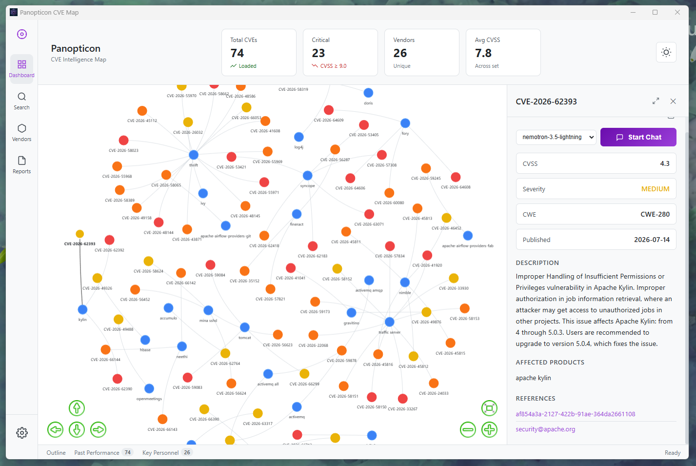
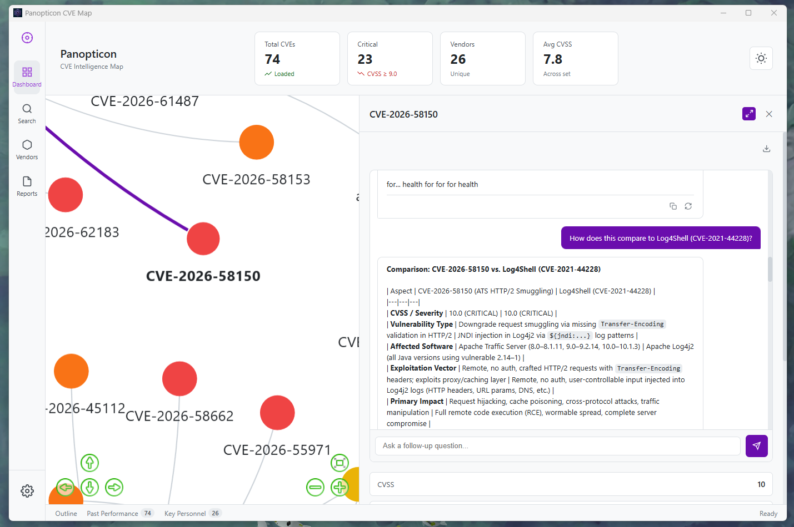
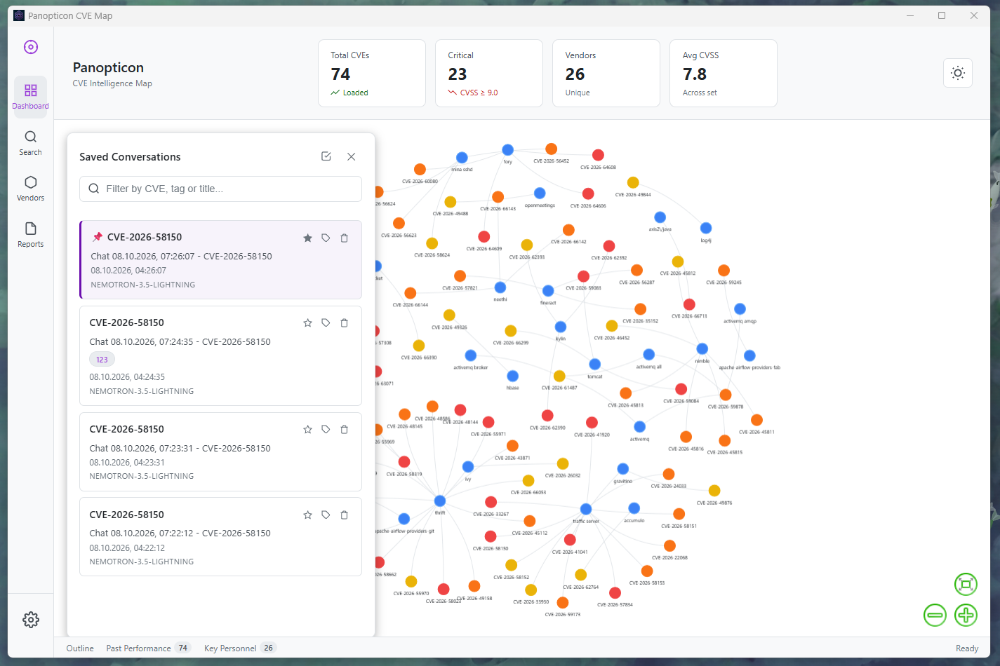
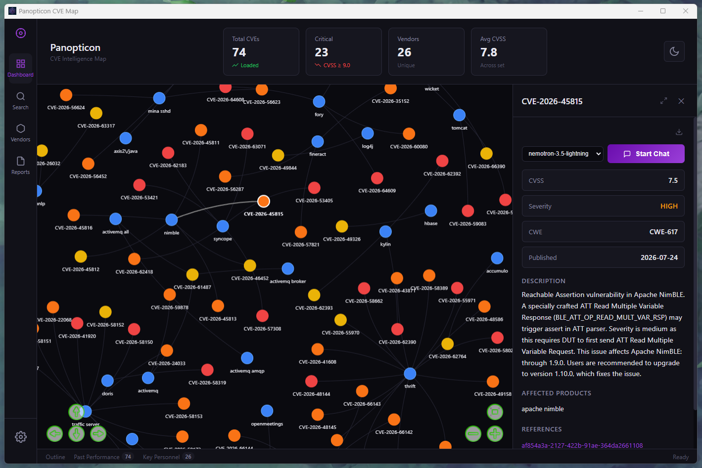

<div align="center">

<a href="https://github.com/sleepti3ht/Panopticon"></a>

# Panopticon

### CVE Intelligence Map · Threat graph + local AI mitigation agent + CISA KEV flags

[](https://tauri.app)
[](https://www.rust-lang.org)
[](https://python.org)
[](https://developer.mozilla.org/en-US/docs/Web/JavaScript)
[](https://modelcontextprotocol.io)
[](https://www.cisa.gov/known-exploited-vulnerabilities-catalog)
[](LICENSE)

</div>

> 👁️ **A desktop-native CVE intelligence map** — interactive force-directed graph of vendor↔CVE relationships wired to a local AI agent that drafts mitigation plans, maintains a versioned chat history, and resumes conversations across sessions. Actively exploited CVEs are flagged straight from the CISA KEV catalog.

Built on **Tauri 2** (Rust shell), **Python** (async AI + MCP client), and **Vanilla JS** with `vis-network`. Local-first, no telemetry, no cloud lock-in.

## Screenshots

<p align="center">
  
  
  
  
</p>

---

## Get started

```bash
git clone https://github.com/sleepti3ht/Panopticon.git
cd Panopticon

# Python backend
cd panopticon-python
python -m venv venv
venv\Scripts\activate        # Windows
source venv/bin/activate     # macOS / Linux
pip install -r requirements.txt
cp .env.example .env         # add your OPENROUTER_API_KEY

# Frontend + Tauri
cd ..
npm install
npm run tauri dev
```

> First launch auto-creates `panopticon.db` (SQLite) with the schema.

### Data: mock or real

```bash
cd panopticon-python
python seed_mock.py          # 50 synthetic CVEs — instant, no API keys
python ingestor.py 4000 90   # real NVD feed: last 90 days, up to 4000 CVEs with CPE
```

The ingestor uses a rolling window counted from request time and auto-chunks requests to respect the NVD 120-day-per-query limit. With a free `NVD_API_KEY` in `.env` it runs ~10× faster (50 vs 5 requests per 30s).

### Configuration (`.env`)

| Variable | Required | Purpose |
|---|---|---|
| `OPENROUTER_API_KEY` | yes | LLM gateway key |
| `NVD_API_KEY` | no | raises NVD rate limit for ingestion |
| `AVAILABLE_MODELS` | no | comma-separated model list for the chat selector |
| `DEFAULT_MODEL` | no | preselected chat model (default: `nemotron-3.5-lightning`) |

## 🔋 Batteries Included

**🕸 Force-directed threat graph**

- `vis-network` with `forceAtlas2Based` solver, auto-stabilization and CPU-off after 1500 iterations
- CVSS-based node coloring (critical → red, high → orange, low → green)
- KEV-listed CVEs get a thick red ring regardless of CVSS
- Search any CVE → graph rebuilds around its vendor scope and the camera focuses on the node
- Instant theme swap (light/dark) via `network.setOptions()` — no re-render

**🔥 CISA KEV awareness**

- Lazy-loads the official Known Exploited Vulnerabilities catalog (~1.7k entries), cached per process
- `ACTIVELY EXPLOITED` row with patch due date in the CVE details panel
- Live NVD API fallback: CVEs missing from the local DB are resolved on the fly and cached for 1 hour

**🤖 Local AI mitigation agent**

- Model Context Protocol (MCP) client for live CVE context retrieval
- Pluggable OpenRouter models via `AVAILABLE_MODELS` (tested: `nemotron-3.5-lightning`, `gemma-4-31b-it`, `qwen-3.8` family)
- Strict 5-point mitigation prompts (risk, immediate actions, long-term, commands, refs)
- Automatic language detection — responds in the user's language
- Categorized provider errors (rate limit / credits / overload) instead of silent failures

**💬 Versioned chat with memory**

- 10-message sliding window passed to Python via stdin — bypasses the Windows 32KB CLI argument limit
- Copy & Regenerate on every message, version indicator (`2/3`)
- Race-condition-safe UI (`isProcessing` guard + `finally`-unblock)
- XSS-safe markdown rendering (HTML-tag escaping before transform)

**📚 Reports — resumable conversations**

- Auto-save to SQLite after every assistant turn
- Click a report → rebuild graph around that CVE (default → vendor-scoped fallback)
- Pins 📌 and tags (up to 8 per report); pinned reports float to the top
- Bulk selection + bulk delete, single delete with confirmation
- Markdown export to a configurable directory (Settings → Export Directory) with explicit AI-generated draft disclosure banner
- Filter box across CVE id, title and tags
- Expand/collapse details panel for long reads (state persisted)
- `save_report.py purge` cleans legacy rows with invalid JSON payloads

**⚙️ Desktop shell**

- No startup flash (window hidden until first paint)
- External links open in system browser
- Debounced search (300ms), mutually exclusive side panels
- Settings popover with `localStorage` for API keys and export path

## 📸 Preview

<p align="center">
  
  <em>Vendor↔CVE force-directed graph · camera focus on critical node · light theme</em>
</p>

## Why Panopticon

Vulnerability triage today is a browser tab soup: NVD, vendor advisories, CISA KEV, ChatGPT, internal runbooks — all in separate windows. The analyst context-switches constantly and the mental model of "this CVE, this vendor, these affected products, these mitigations" never lives in one place.

Panopticon collapses that into a single native surface:

- **Spatial memory** — the graph is the mental map; clicking a CVE recenters the world around it.
- **Stateful analysis** — the AI remembers the conversation and the CVE context simultaneously.
- **Resumable work** — close the app, open it tomorrow, pick up exactly where you left off.
- **Prioritized triage** — KEV flags cut through CVSS noise: exploited beats theoretical.
- **Local by default** — no telemetry, no SaaS middleman, your keys stay on your disk.

## How it works

```
┌─────────────────────────────────────────────────────────────────┐
│                    Vanilla JS (Vite + vis-network)              │
│                                                                 │
│   invoke("chat_with_agent", { cveId, messages, model })         │
└────────────────────┬────────────────────────────────────────────┘
                     │
                     ▼
┌─────────────────────────────────────────────────────────────────┐
│              Tauri 2  ·  Rust command handlers                  │
│                                                                 │
│   async fn chat_with_agent(cve_id, messages, model)             │
└────────────────────┬────────────────────────────────────────────┘
                     │ spawn python.exe · history via stdin
                     ▼
┌─────────────────────────────────────────────────────────────────┐
│                     Python asyncio layer                        │
│                                                                 │
│   ai_agent.py ──► MCP client ──► mcp_server.py (CVE context)    │
│        │                              │                         │
│        │                              ├─► SQLite (local CVE DB) │
│        │                              └─► CISA KEV catalog      │
│        │                                    + NVD live fallback │
│        └──► OpenRouter API  +  SQLite (chat_reports)            │
└─────────────────────────────────────────────────────────────────┘
```

The Rust layer is deliberately thin: it owns the window, routes IPC, and spawns Python processes. All heavy logic (LLM orchestration, graph building, search, persistence) lives in Python, which is easier to iterate on for ML-adjacent work.

## 🧩 Project structure

```
Panopticon/ # repo root = desktop project
├── src/ # Vanilla JS + CSS
│ ├── main.js # UI, graph, chat, panels, reports
│ └── styles.css # Dark/light theme (purple accents)
├── src-tauri/ # Rust shell + IPC commands
│ ├── src/lib.rs # Thin handlers: routing + process spawn
│ └── tauri.conf.json # Window defaults, permissions
── panopticon-python/ # Backend
│ ├── ai_agent.py # LLM orchestration + MCP client
│ ├── mcp_server.py # MCP tools: CVE context, KEV, CWE stats
│ ├── graph_builder.py # Vendor↔CVE graph export + KEV flags
│ ├── global_search.py # Cross-table search
│ ├── get_vendors.py # Vendor list with CVE counts
│ ├── save_report.py # chat_reports CRUD + migrations
│ ├── ingestor.py # NVD → SQLite rolling-window pipeline
│ ├── db.py # Schema + atomic inserts
│ ├── config.py # Env-driven constants
│ ├── utils.py # Secret masking + degenerate-repetition helpers
│ ├── seed_mock.py # 50 synthetic CVEs for demos
│ └── panopticon.db # (auto-created, gitignored)
├── docs/
│ └── img/ # README + article screenshots
├── index.html
├── vite.config.js
└── package.json
```

## 🧑‍💻 Built with

- **[Tauri 2](https://tauri.app)** — native desktop shell
- **[vis-network](https://visjs.org)** — force-directed graph rendering
- **[MCP](https://modelcontextprotocol.io)** — tool-use protocol for LLM context
- **[OpenRouter](https://openrouter.ai)** — multi-model gateway (free tier)
- **[CISA KEV](https://www.cisa.gov/known-exploited-vulnerabilities-catalog)** — exploited-vulnerability catalog
- **[SQLite](https://sqlite.org)** — zero-config local persistence

## Roadmap

- [ ] Streaming LLM responses via Tauri Events (no UI micro-freeze on long reports)
- [ ] In-UI "Sync" button with live ingest log stream (Tauri Events)
- [ ] Persist CISA KEV catalog to a local table (zero-latency flags, offline mode)
- [ ] CWE layer in the graph (vendor weakness patterns)
- [ ] Dashboard trends: 7/30-day publication spikes, top vendors
- [ ] `json_repair` integration for malformed LLM outputs
- [ ] OS-level secret storage (replace `localStorage` API keys)
- [ ] Encrypted `.panopticon` export/import for team handoffs
- [ ] CI release builds (GitHub Actions artifacts per OS)

##  Deep Dive

Read the full architectural breakdown on dev.to: [Building Panopticon: A Local-First CVE Intelligence Map with Tauri 2 + Rust + Python](https://dev.to/sleepti3ht/building-panopticon-a-local-first-cve-intelligence-map-with-tauri-2-rust-python-4p6p)

Covers sampling penalties for LLM repetition collapse, stdin transport bypassing Windows CLI limits, CISA KEV projection bugs, and why vanilla JS won over React for this tool.

## 🧑‍🍳 Related

- **[tauri-ui](https://github.com/agmmnn/tauri-ui)** — inspired the dark/purple visual direction and the README structure
- **[GooEye](https://github.com/sleepti3ht/GooEye)** — sibling project: a stealth sniper bot for 闲鱼(Goofish)

> _Built something with Panopticon's architecture? [Open a PR](https://github.com/sleepti3ht/Panopticon/pulls) adding it to this list — one line with a link and a short description._

---

## License

MIT
